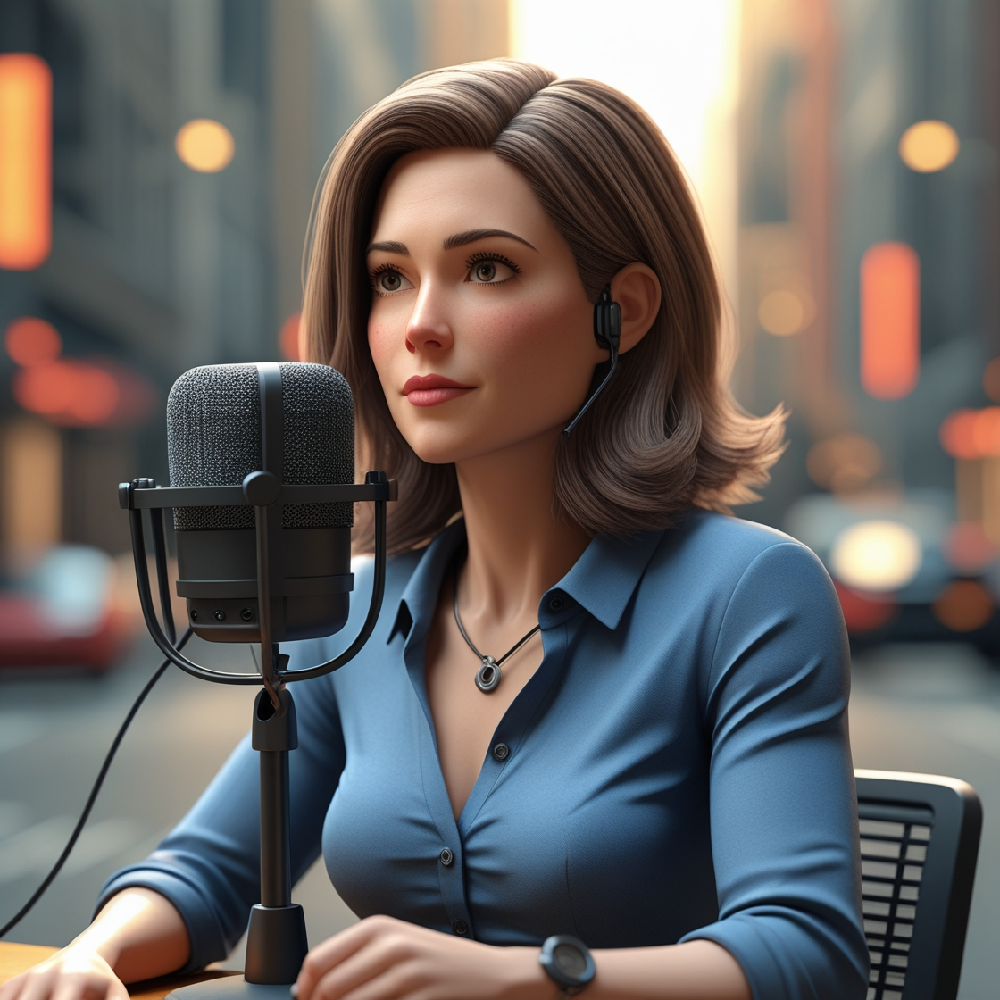

# Podcast gerado por I.A.s

 > Repositório desenvolvido durante o BootCamp - CAIXA - IA Generativa com Microsoft Copilot na plataforma da [DIO](https://dio.me)
>
> Geração de um PodCast através de Inteligência Artificial, usando Prompts.

### Ouça o PosCast agora!!!
## Nebulosa Tech - O Futuro no Ar!

  https://raw.githubusercontent.com/Marcia520/Criando-um-Podcast-com-IAs-Generativas/main/output/PodcastCloud.mp3
  
  
  https://raw.githubusercontent.com/Marcia520/Criando-um-Podcast-com-IAs-Generativas/main/output/PodcastCloudEdit.mp3

## Tecnologias utilizadas no projeto - Prompts e Edição

- [ChatGPT](https://chat.openai.com/) 
- [Leonardo.AI](https://app.leonardo.ai/image-generation)
- [ElevenLabs](https://beta.elevenlabs.io/)
- [Audacity](https://www.audacityteam.org/)

## Como foi feito

- Chatgpt gerou o Roteiro do PodCast
- Leonardo. AI gerou as imagens
- Audio gerado pela elevenLabs
- Audacity editar aúdio

## Materiais

- [PODCAST] (https://raw.githubusercontent.com/Marcia520/Criando-um-Podcast-com-IAs-Generativas/main/output/PodcastCloud.mp3)
- [PODCAST Editado] (https://raw.githubusercontent.com/Marcia520/Criando-um-Podcast-com-IAs-Generativas/main/output/PodcastCloudEdit.mp3)
- [Editor de áudio](https://www.audacityteam.org/)
- Imagens utilizadas em `assets`
- Podcast gerado durante as aulas em `output`
- Roteiro está em `prompts`

## Estudante

    

[Márcia Rodrigues](https://github.com/Marcia520)
